# Dependency Risk Graph

Dependency Risk Graph is a Java-first software supply-chain knowledge graph. It imports CycloneDX JSON SBOMs as RDF, enriches the imported package occurrences with complete OSV advisories, stores both datasets in Apache Jena TDB2, and provides a React interface for application, dependency, vulnerability, reference, CVE-impact, and SPARQL exploration.

The graph is the source of truth. Ingestion and enrichment write RDF; the Explore and SPARQL APIs read the persisted model without making hidden OSV calls.

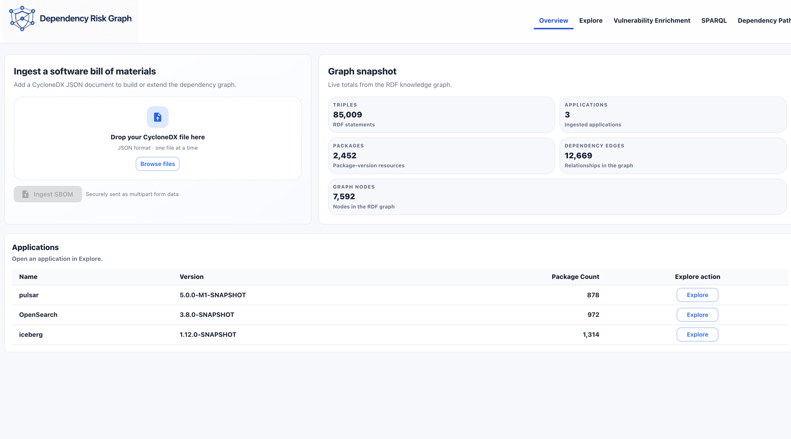

## Table of Contents

- [What the Application Does](#what-the-application-does)
- [Current Architecture](#current-architecture)
  - [Design principles](#design-principles)
- [End-to-End Data Flow](#end-to-end-data-flow)
  - [CycloneDX ingestion](#1-cyclonedx-ingestion)
  - [Application OSV enrichment](#2-application-osv-enrichment)
  - [Explore and CVE impact](#3-explore-and-cve-impact)
  - [Advisory evidence indexing and retrieval](#4-advisory-evidence-indexing-and-retrieval)
- [RDF Model](#rdf-model)
  - [CycloneDX occurrence graph](#cyclonedx-occurrence-graph)
  - [OSV enrichment graph](#osv-enrichment-graph)
- [User Interface](#user-interface)
  - [Overview and ingestion](#overview-and-ingestion)
  - [Application overview](#application-overview)
  - [Dependencies](#dependencies)
  - [Vulnerabilities and advisory detail](#vulnerabilities-and-advisory-detail)
  - [References](#references)
  - [CVE impact](#cve-impact)
  - [SPARQL](#sparql)
  - [AI Workbench advisory evidence](#ai-workbench-advisory-evidence)
- [API Reference](#api-reference)
- [Quick Start](#quick-start)
- [SPARQL Examples](#sparql-examples)
- [Configuration](#configuration)
- [Development](#development)
- [Technology Stack](#technology-stack)
- [Project Structure](#project-structure)
- [Current Limitations](#current-limitations)
- [License](#license)

## What the Application Does

- Accepts a CycloneDX JSON SBOM as multipart form data at `POST /rdf/new`.
- Preserves CycloneDX component `bom-ref` values as RDF resource identities.
- Stores application and package occurrences plus declared `risk:dependsOn` edges.
- Finds application dependencies from the persisted occurrence graph.
- Queries OSV in batches and loads the complete advisory for every returned OSV ID.
- Assembles OSV responses into a separate JSON-LD graph and adds it to Jena.
- Links each scanned package occurrence to vulnerabilities with `risk:affectedBy`.
- Stores advisory aliases, details, timestamps, references, severity vectors, affected packages, version ranges, and range events.
- Provides an application-level enrichment API and a read-only single-PURL lookup API.
- Exposes application-centric Explore tabs for overview, dependencies, vulnerabilities, references, and CVE impact.
- Provides unrestricted read-only SPARQL `SELECT` execution through the UI/API.
- Renders application-to-vulnerability paths with React Flow and ELK.
- Rebuilds an in-memory advisory evidence index from the RDF graph and exposes global semantic evidence search in AI Workbench.

## Current Architecture

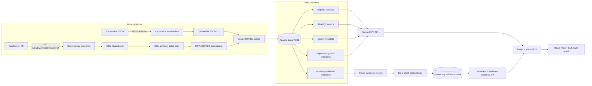

### Design principles

1. **RDF is authoritative.** Explore does not maintain a second vulnerability database.
2. **Writes are explicit.** Selecting an application in Explore does not invoke OSV. The user starts enrichment from the Vulnerability Enrichment screen or API.
3. **CycloneDX and OSV have separate JSON-LD contexts.** Each source is assembled according to its own shape before Jena parses it.
4. **Occurrences retain source identity.** The new importer uses CycloneDX `bom-ref` values directly rather than mapping them back into a separate canonical package layer.
5. **OSV data stays normalized.** References, severities, affected packages, ranges, and events are RDF resources connected to one vulnerability resource.
6. **Reads are application-scoped.** Explore begins at an `ApplicationOccurrence` and follows `risk:dependsOn+` to its reachable packages.
7. **Single-PURL lookup is non-persistent.** `/enrich/purl` returns complete OSV DTO responses but does not patch RDF.
8. **Evidence search is diagnostic and global.** AI Workbench ranks all indexed advisory chunks by semantic similarity; it does not treat a CVE or GHSA mentioned in the query as a retrieval scope.

## End-to-End Data Flow

### 1. CycloneDX ingestion

```text
MultipartFile
  -> CycloneDX parser
  -> metadata/component/dependency assemblers
  -> CycloneDX JSON-LD
  -> Jena Model
  -> default TDB2 graph
```

`CycloneDxMetadataAssembler` creates the root `risk:ApplicationOccurrence`. `CycloneDxComponentAssembler` creates supported application and library occurrences. `CycloneDxDependencyAssembler` writes only dependency relationships declared in the SBOM.

The importer does not infer dependencies from Maven coordinates, component order, directory layout, or PURL similarity.

### 2. Application OSV enrichment

```text
Application IRI
  -> ExplorerService.dependencySummary(applicationIri)
  -> versioned PURL scan plan
  -> OSV batch query
  -> distinct advisory detail loading
  -> Enriched(packageIri, complete OSV responses)
  -> OSV JSON-LD
  -> Jena Model
  -> default TDB2 graph
```

The package identifier in `Enriched` is the imported package occurrence IRI. The enrichment pipeline adds `risk:affectedBy` to that resource. It does not translate the result back into a legacy package-version/import-run model.

`GET /api/v1/vulnerabilities/enrich` returns:

```json
{
  "parsed": 1200,
  "added": 1175,
  "total": 86200
}
```

- `parsed`: triples parsed from the generated OSV JSON-LD document.
- `added`: triples that were not already present in the dataset.
- `total`: triples in the default graph after the write.

### 3. Explore and CVE impact

Explore reads the combined graph:

```text
ApplicationOccurrence
  -> dependsOn+
Package occurrence
  -> affectedBy
Vulnerability
  -> hasReference / hasSeverity / hasAffectedPackage
```

The CVE Impact detail endpoint resolves the dependency path from the selected application occurrence to each affected package occurrence, appends the vulnerability, and returns a graph DTO for React Flow. Shared nodes and edges are deduplicated while exposure IDs preserve which application/package path each edge belongs to.

### 4. Advisory evidence indexing and retrieval

AI Workbench builds retrieval evidence from the advisory data already stored in Jena:

```text
Jena vulnerability resources
  -> advisory source projection
  -> overview / technical details / impact / remediation / severity / upstream-fix chunks
  -> BGE-small-en-v1.5 quantized embeddings
  -> LangChain4j InMemoryEmbeddingStore
  -> global semantic similarity search
  -> ranked Evidence cards
```

`POST /api/workbench/evidence/rebuild` finds all advisory identifiers in the graph, regenerates their typed evidence documents, embeds them, and replaces the complete in-memory evidence store. Embeddings are prepared before the write lock is taken, so existing searches can continue until the brief store replacement.

`POST /api/workbench/assistant/evidence` embeds the natural-language question and searches across every indexed evidence chunk. `maxResults` controls the result limit and `minScore` applies the similarity threshold. The retrieved chunks are supplied to Buggy's configured chat model, and the response contains the question, generated answer summary, evidence matches, final-snitch metadata, and model identity.

This screen intentionally performs **global semantic discovery**. A query that names a CVE can return related advisories when their chunks are semantically similar. The UI shows Buggy's summary after the match count and marks an exact CVE or GHSA only when that identifier actually occurs in the returned vulnerability ID or evidence text. Identifier-scoped graph resolution is not part of this workflow.

## RDF Model

The vocabulary namespace is:

```text
urn:io-github-pkjpathania:dependency-risk-graph:schema:
```

### CycloneDX occurrence graph

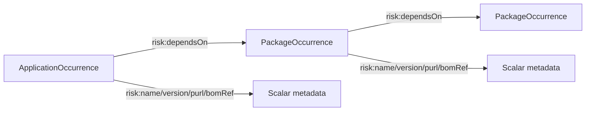

Core classes and properties:

- `risk:ApplicationOccurrence`
- `risk:PackageOccurrence`
- `risk:dependsOn`
- `risk:name`
- `risk:group`
- `risk:version`
- `risk:purl`
- `risk:bomRef`
- `risk:componentType`

### OSV enrichment graph

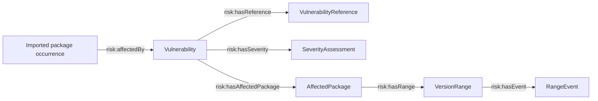

Important OSV properties:

- Vulnerability: `risk:osvId`, `risk:alias`, `risk:summary`, `risk:details`, `risk:publishedAt`, `risk:modifiedAt`, `risk:withdrawnAt`
- References: `risk:hasReference`, `risk:referenceType`, `risk:referenceUrl`
- Severity: `risk:hasSeverity`, `risk:severityType`, `risk:severityScore`
- Affected packages: `risk:hasAffectedPackage`, `risk:affectedPackageName`, `risk:affectedPackagePurl`, `risk:ecosystem`, `risk:affectedVersion`
- Ranges: `risk:hasRange`, `risk:rangeType`, `risk:repositoryUrl`
- Events: `risk:hasEvent`, `risk:introducedVersion`, `risk:fixedVersion`, `risk:lastAffectedVersion`, `risk:limitVersion`

Resource IRIs for vulnerabilities and their child resources are deterministic, allowing repeated enrichment to add only previously unseen triples.

## User Interface

The frontend is a React 19 single-page application bundled into the Spring Boot JAR. Navigation is managed by the application shell rather than a client-side URL router.

### Overview and ingestion

Upload one CycloneDX JSON file, inspect live graph totals, and open an imported application in Explore.


### Application overview

The Overview tab summarizes direct and transitive dependencies, graph size, vulnerable packages, and vulnerability metrics for the selected application.

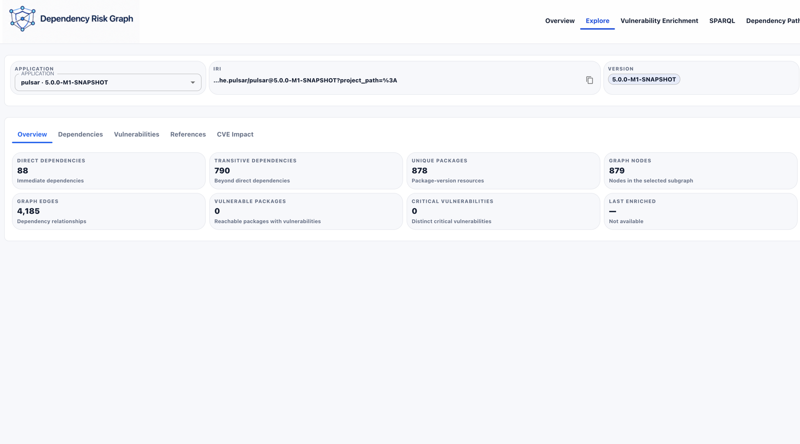

### Dependencies

Dependencies are read by following `risk:dependsOn+` from the selected application. Direct dependencies are distinguished from transitive dependencies.

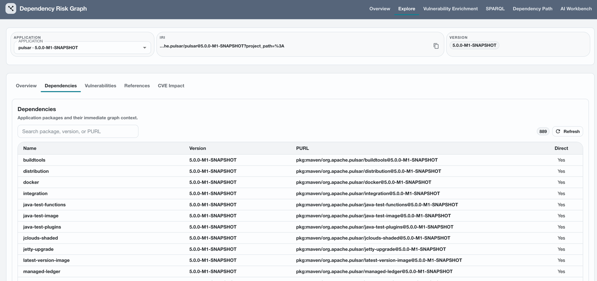

### Vulnerabilities and advisory detail

The Vulnerabilities tab joins imported occurrences to OSV resources. It displays the installed package, dependency type, advisory identity, severity data, CVSS vector type, fixed range events, publication time, complete advisory content, and reference links.

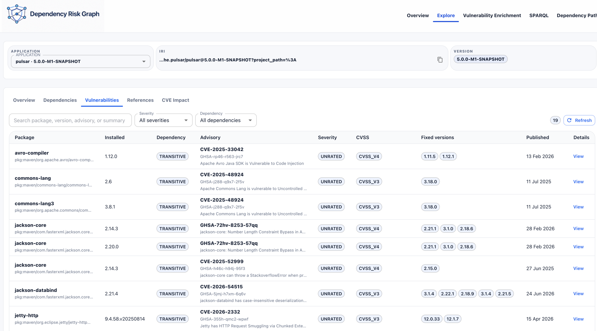

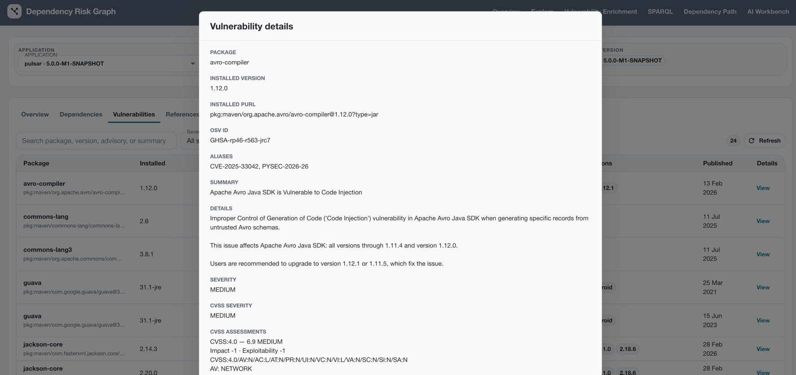

### References

References are stored as dedicated RDF resources. The UI groups them by advisory and displays affected installed packages.

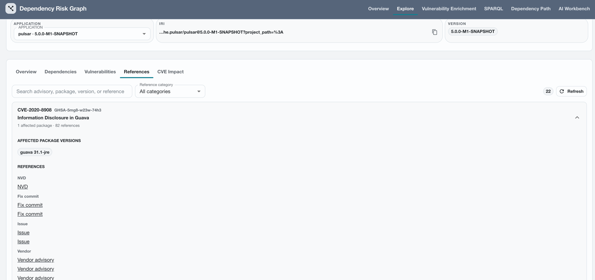

### CVE impact

The initial CVE Impact view groups one vulnerability across selected or all applications.

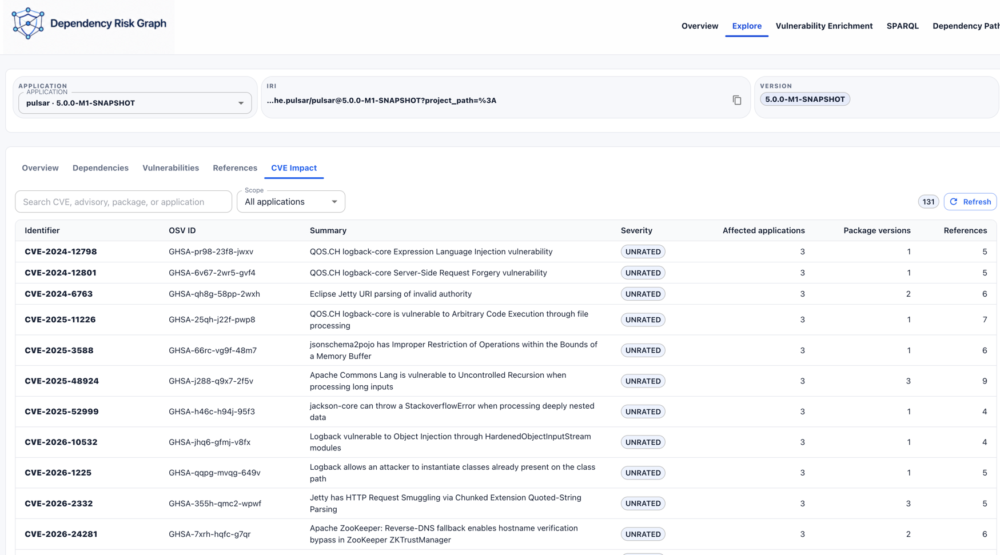

Selecting an advisory opens the focused application-to-package-to-vulnerability diagram. The diagram supports pan, zoom, fit view, layout reset, simplified/detailed modes, node selection, and exposure filtering.

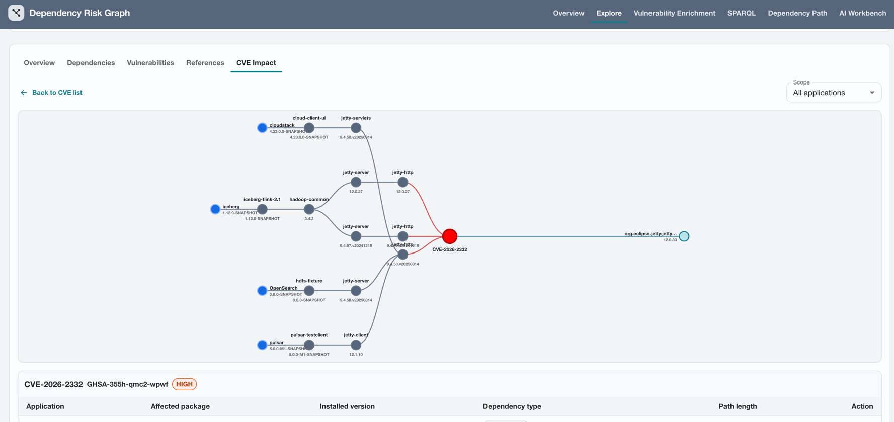

The adjacent detail panel renders OSV advisory content, CVSS data, and complete reference URLs without leaving the dependency diagram.

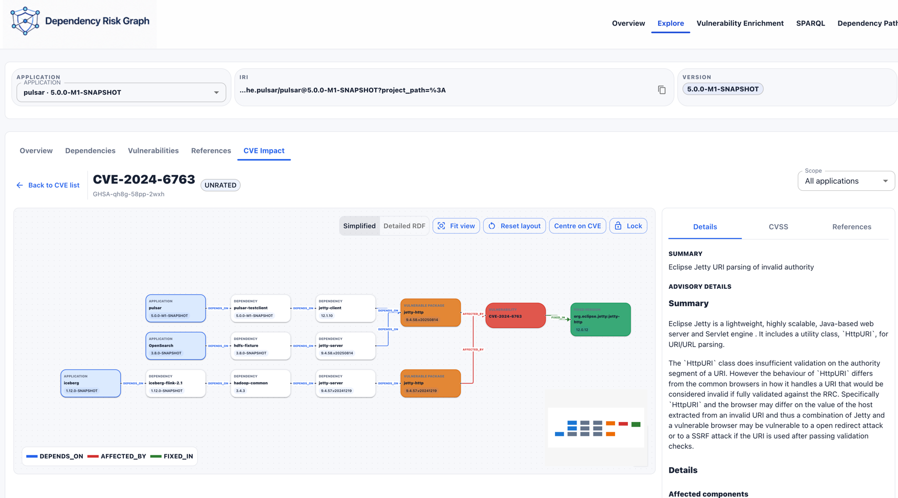

### SPARQL

The SPARQL screen provides prefix presets, example queries, formatting, `SELECT` execution, results, and clipboard export.

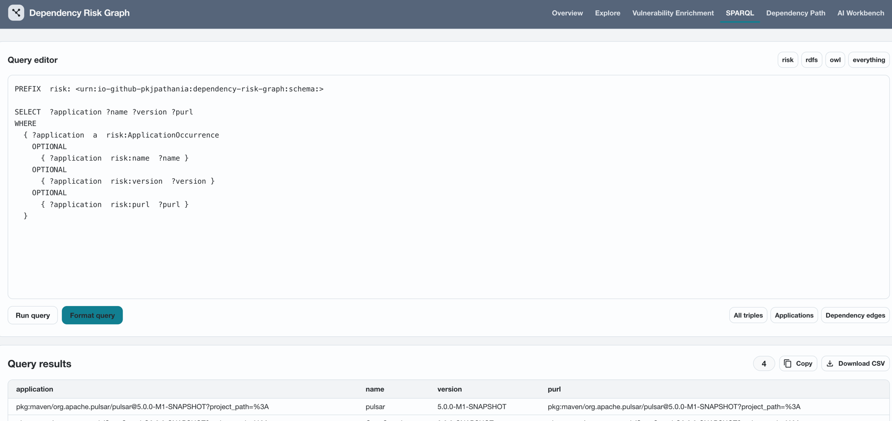

### AI Workbench advisory evidence

The Evidence screen combines Buggy's generated summary with retrieval inspection. It can rebuild the advisory vector index, submit natural-language questions, configure the result limit and minimum score, and inspect the exact chunks used to ground the summary.

Each result displays its global rank, evidence segment type, vulnerability and document identifiers, similarity score, and complete source text. Long chunks expand independently, and the copy action always copies the complete evidence. An exact-identifier marker distinguishes literal CVE/GHSA matches from merely related semantic results.

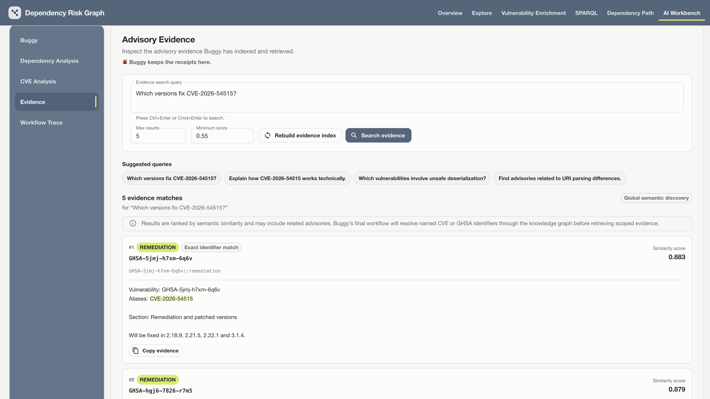

## API Reference

### Primary new flow

| Method | Path | Purpose | Response |
| --- | --- | --- | --- |
| `POST` | `/rdf/new` | Import and persist a multipart CycloneDX JSON file (`file`). | `GraphMetadata` |
| `GET` | `/api/v1/vulnerabilities/enrich?applicationIri=...` | Batch-query OSV, load complete advisories, assemble OSV JSON-LD, and persist it. | `OsvStoreResult` |
| `GET` | `/api/v1/vulnerabilities/enrich/purl?purl=...` | Return complete OSV advisory DTOs for one PURL without writing RDF. | `PurlEnrichment` |

### Graph and Explore APIs

| Method | Path | Purpose |
| --- | --- | --- |
| `GET` | `/api/v1/metadata` | Return graph counts and the JSON-LD representation of the current graph. |
| `GET` | `/api/v1/explore/applications` | List imported applications. |
| `GET` | `/api/v1/explore/overview?applicationIri=...` | Return application graph metrics. |
| `GET` | `/api/v1/explore/dependencies?applicationIri=...` | List reachable dependency occurrences. |
| `GET` | `/api/v1/explore/vulnerabilities?applicationIri=...` | Return package-level vulnerability rows. |
| `GET` | `/api/v1/explore/references?applicationIri=...` | Return references grouped by advisory. |
| `GET` | `/api/v1/explore/cve-impact?scope=selected&applicationIri=...` | Group vulnerabilities for one application. |
| `GET` | `/api/v1/explore/cve-impact?scope=all` | Group vulnerabilities across all applications. |
| `GET` | `/api/v1/explore/cve-impact/detail?vulnerabilityIri=...&scope=...` | Return advisory details, exposures, remediation data, and the focused impact graph. |

### SPARQL and supporting APIs

| Method | Path | Purpose |
| --- | --- | --- |
| `POST` | `/api/v1/sparql/format` | Format a plain-text SPARQL query. |
| `POST` | `/api/v1/sparql/exec` | Execute a SPARQL `SELECT` query. |
| `GET` | `/api/v1/sparql/summaries` | List application summaries. |
| `POST` | `/api/osv` | Pass one package query directly to OSV without graph persistence. |
| `POST` | `/api/v1/vulnerabilities/scan` | Compatibility scan pipeline returning the structured scan response. |
| `GET` | `/api/dependencies/path?importId=...&targetPackageVersionIri=...` | Resolve a path for the older import-scoped graph model. |

### AI Workbench Evidence APIs

| Method | Path | Purpose | Response |
| --- | --- | --- | --- |
| `POST` | `/api/workbench/evidence/rebuild` | Regenerate typed advisory documents and replace the complete in-memory vector index. | `AdvisoryEvidenceDocument[]` |
| `POST` | `/api/workbench/assistant/evidence` | Retrieve global semantic evidence and generate Buggy's grounded summary. | `BuggyAnswerResponse` |

## Quick Start

### Requirements

- JDK 21 or newer
- Internet access during the first Maven build and for live OSV enrichment
- No separate Node installation is required for the Maven build; the frontend plugin installs the configured Node version

### Build

```bash
./mvnw clean package
```

The Maven lifecycle installs frontend dependencies, creates the Vite production bundle, copies it into the application resources, compiles Java, runs tests, and builds the executable JAR.

### Run

```bash
java -jar target/dependency-risk-graph-0.0.1-SNAPSHOT.jar
```

Or:

```bash
./mvnw spring-boot:run
```

Open `http://localhost:8080`.

### Import an SBOM

```bash
curl -sS -X POST http://localhost:8080/rdf/new \
  -F 'file=@/path/to/application.cdx.json'
```

The default multipart limit is 20 MB.

### Enrich an application

Use the application IRI returned by the application list or SPARQL query:

```bash
curl -sS -G http://localhost:8080/api/v1/vulnerabilities/enrich \
  --data-urlencode 'applicationIri=pkg:maven/org.example/application@1.0.0'
```

### Find complete advisories for one PURL

```bash
curl -sS -G http://localhost:8080/api/v1/vulnerabilities/enrich/purl \
  --data-urlencode 'purl=pkg:maven/org.apache.commons/commons-lang3@3.18.0'
```

This endpoint returns the PURL and complete OSV advisory responses. It does not modify the RDF graph.

### Rebuild and search advisory evidence

Rebuild the in-memory index after advisory data has been added or updated:

```bash
curl -sS -X POST http://localhost:8080/api/workbench/evidence/rebuild
```

Then run a global semantic search:

```bash
curl -sS -X POST http://localhost:8080/api/workbench/assistant/evidence \
  -H 'Content-Type: application/json' \
  -d '{
    "question": "Which versions fix CVE-2026-54515?",
    "maxResults": 5,
    "minScore": 0.55
  }'
```

The evidence index is process-local and is not persisted to TDB2. Rebuild it after an application restart before searching.

## SPARQL Examples

### Applications

```sparql
PREFIX risk: <urn:io-github-pkjpathania:dependency-risk-graph:schema:>

SELECT ?application ?name ?version ?purl
WHERE {
  ?application a risk:ApplicationOccurrence .
  OPTIONAL { ?application risk:name ?name . }
  OPTIONAL { ?application risk:version ?version . }
  OPTIONAL { ?application risk:purl ?purl . }
}
ORDER BY LCASE(STR(?name))
```

### Dependencies for one application

```sparql
PREFIX risk: <urn:io-github-pkjpathania:dependency-risk-graph:schema:>

SELECT DISTINCT ?package ?name ?version ?purl ?direct
WHERE {
  VALUES ?application { <APPLICATION_IRI> }
  ?application risk:dependsOn+ ?package .
  OPTIONAL { ?package risk:name ?name . }
  OPTIONAL { ?package risk:version ?version . }
  OPTIONAL { ?package risk:purl ?purl . }
  BIND(EXISTS { ?application risk:dependsOn ?package } AS ?direct)
}
ORDER BY DESC(?direct) LCASE(STR(?name))
```

### Enriched vulnerabilities and references

```sparql
PREFIX risk: <urn:io-github-pkjpathania:dependency-risk-graph:schema:>

SELECT ?packageName ?packageVersion ?osvId ?alias ?referenceUrl
WHERE {
  VALUES ?application { <APPLICATION_IRI> }
  ?application risk:dependsOn+ ?package .
  ?package risk:name ?packageName ;
           risk:affectedBy ?vulnerability .
  OPTIONAL { ?package risk:version ?packageVersion . }
  ?vulnerability a risk:Vulnerability ; risk:osvId ?osvId .
  OPTIONAL { ?vulnerability risk:alias ?alias . }
  OPTIONAL {
    ?vulnerability risk:hasReference/risk:referenceUrl ?referenceUrl .
  }
}
ORDER BY LCASE(STR(?packageName)) LCASE(STR(?osvId))
```

### Severity vectors and fixed range events

```sparql
PREFIX risk: <urn:io-github-pkjpathania:dependency-risk-graph:schema:>

SELECT ?osvId ?severityType ?severityScore ?fixedVersion
WHERE {
  ?vulnerability a risk:Vulnerability ; risk:osvId ?osvId .
  OPTIONAL {
    ?vulnerability risk:hasSeverity ?severity .
    ?severity risk:severityType ?severityType ;
              risk:severityScore ?severityScore .
  }
  OPTIONAL {
    ?vulnerability risk:hasAffectedPackage/risk:hasRange/risk:hasEvent ?event .
    ?event risk:fixedVersion ?fixedVersion .
  }
}
ORDER BY LCASE(STR(?osvId)) STR(?fixedVersion)
```

## Configuration

Primary settings are in `src/main/resources/application.yaml`:

```yaml
spring:
  servlet:
    multipart:
      max-file-size: 20MB
      max-request-size: 20MB

dependency-risk:
  osv:
    enabled: true
    batch-size: 50
    advisory-fetch-threads: 8
    output-directory: src/main/resources/osv
    max-attempts: 3
    connect-timeout: 10s
    read-timeout: 45s
```

The TDB2 location defaults to `./data/tdb2` and can be overridden with:

```yaml
dependency-risk:
  graph-db:
    path: /path/to/tdb2
```

The same configuration file contains the CycloneDX and OSV JSON-LD contexts. When adding a new RDF property, update the relevant context and its assembler together.

## Development

### Frontend with hot reload

```bash
cd src/main/frontend
npm ci
npm run dev
```

Vite runs on `http://localhost:5173` and proxies API requests to the Spring Boot server on port 8080.

### Tests

```bash
./mvnw test
```

```bash
cd src/main/frontend
npm test
```

```bash
cd src/main/frontend
npm run build
```

## Technology Stack

- Java 21
- Spring Boot 4.1
- Apache Jena 6.1 with TDB2 and ARQ
- CycloneDX Core Java 12.2
- JGraphT 1.5
- React 19 and TypeScript
- Material UI
- LangChain4j with the quantized BGE-small-en-v1.5 embedding model
- LangChain4j `InMemoryEmbeddingStore` for advisory evidence
- React Flow (`@xyflow/react`)
- ELK.js layered graph layout
- Vite
- OSV REST APIs through Spring `RestClient`

## Project Structure

```text
src/main/java/io/github/pkjpathania/dependencyrisk/
  graph/
    controller/             RDF, Explore, SPARQL, and path APIs
    parser/assembler/       CycloneDX JSON-LD assembly
    repo/                   Jena persistence and graph projection
    service/                Explore, CVE impact, SPARQL, and graph services
  vulnerability/
    assembler/              OSV JSON-LD assembly
    client/                 OSV request/response client
    service/                batching, advisory loading, and enrichment
  workbench/
    api/                    advisory evidence rebuild and search endpoints
    config/                 local embedding model and in-memory store
    evidence/               RDF projection, chunking, indexing, and search

src/main/frontend/src/
  pages/                    top-level application screens
  components/workbench/     Workbench shell and Evidence result components
  api/workbenchEvidence.ts  typed Evidence HTTP integration
  features/explore/         Explore tabs and CVE impact graph
  features/sparql/          SPARQL presets and helpers

docs/sample/                README screenshots
data/tdb2/                  local embedded RDF dataset
```

## Current Limitations

- Only CycloneDX JSON is accepted by the new ingestion endpoint.
- Ingestion and enrichment add triples to the default graph; they do not remove an older application snapshot or stale vulnerability links.
- Only dependencies with usable PURLs can be sent to OSV.
- OSV severity vectors are preserved, but the application does not infer a `CRITICAL`, `HIGH`, `MODERATE`, or `LOW` classification when OSV does not provide one.
- SPARQL execution accepts `SELECT` queries only.
- TDB2 is an embedded local dataset, not a distributed graph service.
- The import-scoped dependency-path endpoint belongs to the older graph model and is not populated by `POST /rdf/new`.
- The UI uses in-memory page navigation rather than routable browser URLs.
- Authentication and authorization are not implemented.
- Advisory evidence retrieval is global semantic discovery, not CVE/GHSA-scoped retrieval through the knowledge graph.
- The advisory embedding store is in memory and must be rebuilt after each application restart.
- AI Workbench summaries use global semantic evidence; identifier-scoped graph retrieval, conversation memory, and agent workflows are not yet implemented.

## License

Copyright 2026 Pankaj Pathania.

Licensed under the Apache License, Version 2.0. See [LICENSE](LICENSE) for details.
