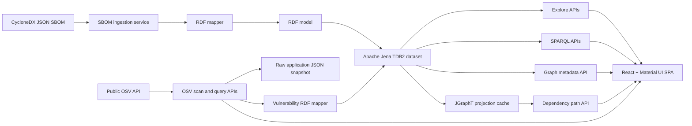

# Dependency Risk Graph

Dependency Risk Graph is a Java-first software-supply-chain knowledge-graph prototype. It ingests CycloneDX JSON SBOMs, maps dependency information into RDF, persists the graph with Apache Jena TDB2, and exposes a React + Material UI interface for exploring applications, dependencies, SPARQL results, and dependency paths.

The repository is intentionally split between implemented features and planned capabilities. The current codebase is a working technical prototype, not a finished Graph-RAG platform.

## Why This Project Exists

Software supply-chain analysis usually ends up split across disconnected tools: SBOM ingestion, graph storage, SPARQL, path search, and vulnerability lookups. This project exists to keep the graph authoritative in RDF while also providing a read-optimized in-memory projection for path algorithms and a simple UI for application-centric exploration.

The long-term direction is a hybrid dependency-risk and Graph-RAG system, but only the RDF, SPARQL, JGraphT, and UI pieces that are actually wired into the code are documented here.

## Current Capabilities

- CycloneDX JSON SBOM ingestion and normalization.
- RDF mapping of applications, package versions, and dependency edges.
- Persistence to a local Apache Jena TDB2 dataset.
- Graph metadata and application exploration APIs.
- SPARQL `SELECT` execution and query formatting.
- Dependency-path lookup with a JGraphT BFS projection.
- Application-level OSV batch scanning with full advisory loading.
- Raw OSV application snapshots and vulnerability RDF persistence.
- Explore views for vulnerability metrics, findings, CVSS assessments, fixed versions, and advisory references.
- OSV query passthrough to the public OSV API.
- React + Material UI frontend bundled into the Spring Boot application.

## Architecture Overview



### How the pieces fit together

- The RDF model is the authoritative graph representation.
- Jena TDB2 stores the graph in a local embedded dataset.
- JGraphT is a read-optimized in-memory projection used for shortest-path lookup, not the primary database.
- The frontend is a single-page shell that switches between Overview, Explore, Vulnerability Enrichment, SPARQL, and Dependency Path without React Router.

## Data Flow

1. A CycloneDX JSON file is uploaded through the SBOM API.
2. The parser normalizes the SBOM into applications, components, and dependency edges.
3. The RDF mapper converts the normalized model into RDF triples.
4. The RDF triples are added to the local Jena TDB2 dataset.
5. An optional application OSV scan batches versioned package PURLs, loads each distinct advisory, and writes a raw JSON snapshot.
6. The scan maps package-to-vulnerability, CVSS assessment, and fixed-version resources into Jena TDB2.
7. Explore and SPARQL APIs read the persisted graph data without calling OSV.
8. The dependency-path service builds or reuses a JGraphT snapshot from the repository state.
9. The React UI renders the resulting data in the Overview, Explore, Vulnerability Enrichment, SPARQL, and Dependency Path pages.

## RDF Graph Model

The current mapper uses a minimal vocabulary under:

`urn:io.github.pkjpathania.dependencyrisk:schema:`

Implemented RDF concepts and properties include:

- `risk:Application`
- `risk:PackageVersion`
- `risk:Vulnerability`
- `risk:CvssAssessment`
- `risk:dependsOn`
- `risk:version`
- `risk:purl`
- `risk:osvId`
- `risk:affectedBy`
- `risk:alias`
- `risk:summary`
- `risk:details`
- `risk:publishedAt`
- `risk:modifiedAt`
- `risk:withdrawnAt`
- `risk:referenceUrl`
- `risk:fixedIn`
- `risk:hasSeverity`
- `risk:cvssType`
- `risk:cvssVersion`
- `risk:vector`
- `risk:severityLevel`
- `risk:source`

The mapper currently materializes the following RDF shape:

- Applications are typed as `risk:Application` and labeled with `rdfs:label`.
- Package versions are typed as `risk:PackageVersion` and labeled with `rdfs:label`.
- Package versions can carry `risk:version` and `risk:purl`.
- Dependency edges are expressed with `risk:dependsOn`.
- Installed packages link to deterministic vulnerability resources through `risk:affectedBy`.
- Vulnerabilities link to deterministic CVSS assessment resources through `risk:hasSeverity`.
- Vulnerabilities link to deterministic fixed package-version resources through `risk:fixedIn`.
- Resource IRIs are generated as URNs, not raw PURLs.

The current implementation keeps the vocabulary intentionally small. OSV enrichment persists advisory attributes, aliases, reference URLs, CVSS vectors, and fixed package versions. It does not calculate numeric CVSS scores or infer additional RDF statements.

## Technology Stack

- Java 21
- Spring Boot 4.1
- Apache Jena 6.1
- JGraphT
- CycloneDX Java libraries
- React 19
- TypeScript
- Vite
- Material UI
- OSV REST API client via Spring `RestClient`

## Screens or UI Capabilities

The UI currently exposes five main pages:

- Overview
  - Graph metrics
  - SBOM upload
  - Application list with an Explore action
- Explore
  - Application selector
  - Application summary cards, including vulnerable-package and critical-vulnerability metrics
  - Dependencies table with search, count, and refresh controls
  - Vulnerabilities table with search, filters, count, refresh, pagination, severity, CVSS, fixed versions, and advisory details
  - Grouped advisory references with search, category filtering, count, refresh, pagination, and affected package versions
- Vulnerability Enrichment
  - Application selection and explicit OSV scan action
  - Scan metrics and package-level findings
- SPARQL
  - Query editor
  - Prefix helpers
  - Format and run actions
  - Results table
- Dependency Path
  - Package name and version search
  - Shortest-path rendering

The app uses an internal navigation shell rather than a route-based client router.

## Build and Run Instructions

### Full build

```bash
./mvnw clean package
```

This is the most reliable full build command. From the Maven configuration, it also:

- installs Node.js through `frontend-maven-plugin`
- runs `npm ci` in `src/main/frontend`
- runs the frontend production build
- copies the generated frontend assets into the Spring Boot build output

### Run the application

After a successful build:

```bash
java -jar target/dependency-risk-graph-0.0.1-SNAPSHOT.jar
```

You can also use Maven to launch the Spring Boot application:

```bash
./mvnw spring-boot:run
```

The backend listens on `http://localhost:8080`.

## Development-Mode Instructions

### Frontend only

```bash
cd src/main/frontend
npm ci
npm run dev
```

The Vite dev server runs on `http://localhost:5173` by default and proxies `/api` requests to `http://localhost:8080`.

### Backend only

```bash
./mvnw spring-boot:run
```

Use this alongside the Vite dev server if you want live frontend development with the real backend.

## API Reference

| Method | Path | Purpose | Important parameters | Response type |
| --- | --- | --- | --- | --- |
| `POST` | `/api/v1/sboms` | Parse a CycloneDX JSON SBOM into the normalized model. | Multipart `file` part. | `NormalizedSbom` |
| `POST` | `/api/v1/sboms/rdf` | Parse a CycloneDX JSON SBOM and add the mapped RDF model to the dataset. | Multipart `file` part. | `GraphSummary` |
| `GET` | `/api/v1/metadata` | Read the current RDF graph summary and JSON-LD payload. | None. | `GraphMetadata` |
| `GET` | `/api/v1/explore/applications` | List application summaries for the Explore page. | None. | `List<ApplicationSummary>` |
| `GET` | `/api/v1/explore/overview` | Return application-level graph metrics. | `applicationIri` query parameter. | `ApplicationOverview` |
| `GET` | `/api/v1/explore/dependencies` | Return dependency rows for the selected application. | `applicationIri` query parameter. | `List<DependencySummary>` |
| `GET` | `/api/v1/explore/vulnerabilities` | Read structured package vulnerability data from RDF. | `applicationIri` query parameter. | `ApplicationVulnerabilitiesResponse` |
| `GET` | `/api/v1/explore/references` | Read advisory references from RDF, grouped by vulnerability. | `applicationIri` query parameter. | `ApplicationReferencesResponse` |
| `POST` | `/api/v1/vulnerabilities/scan` | Scan one application through OSV, write its raw snapshot, and persist vulnerability RDF. | JSON body containing `applicationIri`. | `ApplicationVulnerabilityScanResponse` |
| `GET` | `/api/v1/sparql/summaries` | List application summaries for the SPARQL page. | None. | `List<ApplicationSummary>` |
| `POST` | `/api/v1/sparql/format` | Format raw SPARQL text. | Plain-text request body. | `String` in `application/sparql-query` format |
| `POST` | `/api/v1/sparql/exec` | Execute a SPARQL `SELECT` query. | Plain-text request body. | `SparqlSelectResponse` |
| `GET` | `/api/dependencies/path` | Find the shortest dependency chain to a package version. | `packageName`, optional `version`. | `DependencyPathResult` |
| `POST` | `/api/osv` | Proxy an OSV package query to the public OSV service. | JSON body with `package.purl`. | `OsvQueryResponse` |

## OSV Vulnerability Enrichment

OSV enrichment is enabled in `src/main/resources/application.yaml`:

```yaml
dependency-risk:
  osv:
    enabled: true
    batch-size: 100
    advisory-fetch-threads: 8
    output-directory: src/main/resources/osv
```

The application must already exist in the RDF graph. Invoke a scan with its application IRI:

```bash
curl -s -X POST http://localhost:8080/api/v1/vulnerabilities/scan \
  -H 'Content-Type: application/json' \
  -d '{
    "applicationIri": "urn:io.github.pkjpathania.dependencyrisk:resource:application:kafka:4.4.0-snapshot"
  }'
```

The same operation is available in the **Vulnerability Enrichment** screen. Scans are explicit; opening Explore does not trigger OSV calls. After a successful scan, Explore reads the newly persisted RDF through its overview, vulnerability, and reference endpoints.

Only packages with versioned PURLs are queryable. Missing or unversioned PURLs are reported as skipped. Batch and advisory failures are isolated where possible so one failed request does not abort the complete application scan.

Raw snapshots are written to `<output-directory>/data/osv/{sanitized-application-name}.json`. Each successful write replaces the previous snapshot for that application.

## Example CycloneDX Upload

The RDF route is the one that updates the graph:

```bash
curl -s -X POST http://localhost:8080/api/v1/sboms/rdf \
  -F "file=@sample-sbom.json"
```

If you only want the normalized SBOM payload:

```bash
curl -s -X POST http://localhost:8080/api/v1/sboms \
  -F "file=@sample-sbom.json"
```

## Example SPARQL Queries

### List applications

```sparql
PREFIX risk: <urn:io.github.pkjpathania.dependencyrisk:schema:>
PREFIX rdfs: <http://www.w3.org/2000/01/rdf-schema#>

SELECT ?application ?name ?version
WHERE {
  ?application a risk:Application ;
               rdfs:label ?name .
  OPTIONAL {
    ?application risk:version ?version .
  }
}
ORDER BY LCASE(?name)
```

### Verify OSV vulnerability enrichment

Run these queries after an application vulnerability scan.

```sparql
PREFIX risk: <urn:io.github.pkjpathania.dependencyrisk:schema:>
PREFIX rdfs: <http://www.w3.org/2000/01/rdf-schema#>

SELECT ?package ?packageName ?installedVersion ?osvId ?alias
WHERE {
  ?package a risk:PackageVersion ;
           rdfs:label ?packageName ;
           risk:version ?installedVersion ;
           risk:affectedBy ?vulnerability .

  ?vulnerability a risk:Vulnerability ;
                 risk:osvId ?osvId .

  OPTIONAL { ?vulnerability risk:alias ?alias . }
}
ORDER BY ?packageName ?osvId
```

```sparql
PREFIX risk: <urn:io.github.pkjpathania.dependencyrisk:schema:>

SELECT ?osvId ?cvssType ?cvssVersion ?vector
WHERE {
  ?vulnerability risk:osvId ?osvId ;
                 risk:hasSeverity ?assessment .

  ?assessment a risk:CvssAssessment ;
              risk:cvssType ?cvssType ;
              risk:vector ?vector .

  OPTIONAL { ?assessment risk:cvssVersion ?cvssVersion . }
}
ORDER BY ?osvId ?cvssVersion
```

```sparql
PREFIX risk: <urn:io.github.pkjpathania.dependencyrisk:schema:>
PREFIX rdfs: <http://www.w3.org/2000/01/rdf-schema#>

SELECT ?osvId ?packageName ?fixedVersion ?fixedPurl
WHERE {
  ?vulnerability risk:osvId ?osvId ;
                 risk:fixedIn ?fixedPackage .

  ?fixedPackage a risk:PackageVersion ;
                rdfs:label ?packageName ;
                risk:version ?fixedVersion .

  OPTIONAL { ?fixedPackage risk:purl ?fixedPurl . }
}
ORDER BY ?osvId ?packageName ?fixedVersion
```

### List direct dependencies for one application

Replace the application IRI in the `VALUES` block with a real application resource from the graph.

```sparql
PREFIX risk: <urn:io.github.pkjpathania.dependencyrisk:schema:>
PREFIX rdfs: <http://www.w3.org/2000/01/rdf-schema#>

SELECT ?dependency ?name ?version ?purl
WHERE {
  VALUES ?application {
    <urn:io.github.pkjpathania.dependencyrisk:resource:application:kafka:4.4.0-snapshot>
  }

  ?application a risk:Application ;
               risk:dependsOn ?dependency .

  ?dependency a risk:PackageVersion ;
              rdfs:label ?name .

  OPTIONAL {
    ?dependency risk:version ?version .
  }

  OPTIONAL {
    ?dependency risk:purl ?purl .
  }
}
ORDER BY LCASE(?name)
```

## Dependency-Path Example

The dependency-path API expects a package name and optional version:

```bash
curl -s "http://localhost:8080/api/dependencies/path?packageName=spring-core&version=7.0.8"
```

If multiple versions share the same package name, pass `version` to disambiguate the lookup.

## Persistence and Runtime Behavior

- The Jena dataset is stored locally under `data/tdb2`.
- `POST /api/v1/sboms/rdf` adds the mapped RDF model to the default Jena dataset; it does not clear existing triples first.
- Graph metadata and SPARQL queries read directly from the dataset.
- Application OSV scans replace the configured raw JSON snapshot for that application and add or refresh vulnerability RDF in one repository write transaction.
- Explore vulnerability and reference endpoints read only from Jena TDB2 and never invoke OSV.
- The JGraphT dependency-path projection is cached in memory and built from the repository snapshot on demand.
- There is no automatic invalidation hook for the JGraphT cache after RDF writes, so a long-running process can become stale for path queries.
- `POST /api/osv` remains a standalone live-query passthrough; application persistence is performed by `/api/v1/vulnerabilities/scan`.

## Current Limitations

- CycloneDX JSON is the only supported ingestion format.
- The RDF vocabulary is intentionally minimal.
- SPARQL execution currently supports `SELECT` queries only.
- Jena TDB2 is a local embedded store, not a distributed graph database.
- JGraphT is a read-optimized in-memory projection and can lag behind RDF writes.
- Multiple applications in the graph can make package-name lookups ambiguous.
- Stale `risk:affectedBy` links are not yet removed when a previously vulnerable package later returns no findings.
- Authentication and authorization are not included.
- Test coverage is still small compared with the amount of source code.
- The planned Graph-RAG layer is not implemented yet.

## Roadmap

### Implemented

- [x] CycloneDX JSON parsing and normalization.
- [x] RDF mapping for applications, package versions, and dependency edges.
- [x] Jena TDB2 persistence and SPARQL read APIs.
- [x] Overview, Explore, Vulnerability Enrichment, SPARQL, and Dependency Path UI pages.
- [x] JGraphT-backed shortest-path lookup.
- [x] OSV query passthrough endpoint.
- [x] Application-level OSV batch scanning and full advisory loading.
- [x] Raw application OSV snapshots.
- [x] RDF persistence for vulnerabilities, CVSS assessments, and fixed package versions.
- [x] Explore vulnerability and grouped reference views.

### Planned

- [ ] Remove stale package vulnerability links after successful zero-result tracking is available.
- [ ] Model affected ranges beyond the currently persisted fixed-version resources.
- [ ] Add provenance and named-graph support for multiple SBOMs.
- [ ] Add SHACL validation for graph shape constraints.
- [ ] Add OWL or rule-based inference where it is useful.
- [ ] Add hybrid graph-plus-vector retrieval for Graph-RAG workflows.
- [ ] Add Java-first agent orchestration on top of the graph.
- [ ] Add retrieval and prompt-evaluation tooling.
- [ ] Add stronger automated test coverage and end-to-end tests.
- [ ] Add Docker and Kubernetes deployment examples.

## Project Structure

- `src/main/java` - backend controllers, services, repository code, RDF mapping, and OSV client code
- `src/main/resources` - Spring Boot configuration
- `src/main/frontend` - React application bundled into the backend build
- `src/main/frontend/src/pages` - main UI pages
- `src/main/frontend/src/features/explore` - Explore page components and API helpers
- `src/main/frontend/src/features/sparql` - SPARQL page helpers and prefix utilities
- `src/test/java` - backend and JSON serialization tests
- `data/tdb2` - local Jena TDB2 dataset

## Testing

Automated tests cover:

- Spring Boot application context loading.
- Jena repository and Explorer query behavior.
- OSV planning, batching, advisory loading, finding assembly, and raw snapshots.
- Vulnerability, CVSS assessment, and fixed-version RDF mapping.
- OSV request/response DTO serialization and deserialization.
- Explore Vulnerabilities and References component behavior.

Recommended commands:

```bash
./mvnw test
```

For frontend type-checking:

```bash
cd src/main/frontend
npm run typecheck
```

For frontend component tests:

```bash
cd src/main/frontend
npm test
```

## Contributing

- Keep changes small and source-driven.
- Update RDF vocabulary and README examples together when the graph model changes.
- Add tests for parser, mapper, controller, and serializer changes.
- Separate implemented behavior from planned behavior in documentation and code comments.
- Prefer the existing Spring Boot, Jena, and Material UI patterns already in the repository.

## License Status

No explicit license file is present in the repository at the time of writing.
